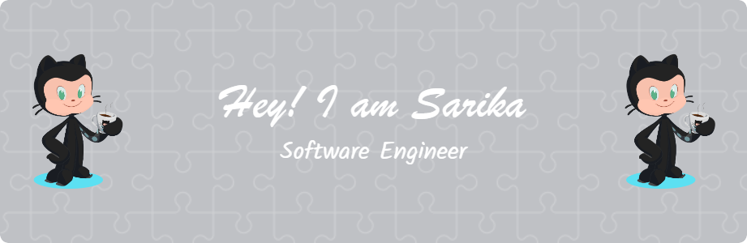

<pre>
                      ▒▒▒▒▒▒▒                                         ▒▒▒▒      
                   ▒▒▒      ▒▒▒                                     ▒▒▒  ▒▒     
                ▒▒▒            ▒▒▒            /////////////\\\\     ▒▒    ▒▒▒▒▒▒
               ▒                  ▒▒▒▒       (((((((((((((( \\\\    ▒▒          
                                     ▒▒▒▒▒▒▒ ))) ~~      ~~  (((▒▒▒▒▒           
                                             ((( (┘)     (┘) )))                
                                             )))     <       (((                
                                _______      ((( '\______/`  )))                
              XXXXXXXXXXXXXXXX |.-----.|XXXXX)))\___________/((( XXXXXXXXXXXXXXX
                               ||x . x||            _) (_                       
                               ||_.-._||           / \_/ \                      
              XXXXXXXXXXXXXXXX `--)-(--`XXXXXXXXXX/(     )\XXXXXXXXXXXXXXXXXXXXX
                              __[=== o]___       // )___( \\                    
                             |:::::::::::|\      \\(     )//                    
                             `-=========-`()      (       )                     
                                                   |  |  |                      
                                                    | | |                       
                                                    | | |                       
                                                   _|_|_|_ 
                                               
                                               ┌──┤ SOCIAL ├─────────▰▰▰
│
├─◈ 
Gmail: sarika.ks.official@gmail.com

├─◈ <a href="https://www.youtube.com/@pickupwhereyouleft7647">YouTube</a>
├─◈ <a href="https://medium.com/@sarika.ks.official">Medium</a>
├─◈ <a href="https://www.linkedin.com/in/sarika-k-s-b094b61ba/">LinkedIn</a>
│
└───────────────────────────────▰▰▰                                                                           
</pre>

